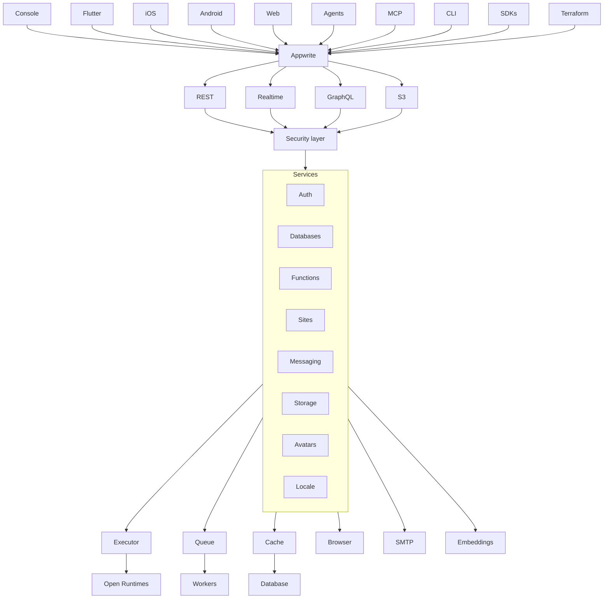

<br />
<p align="center">
    <h1>Appwrite</h1>
    <b>Appwrite is an open-source, all-in-one development platform. Use built-in backend infrastructure and web hosting, all from a single place.</b>
    <br />
    <br />
</p>

[](https://appwrite.io/discord)
[](https://x.com/appwrite)
[](https://cloud.appwrite.io)

English | [简体中文](README-CN.md)

Appwrite is an open-source development platform for building web, mobile, and AI applications. It brings together backend infrastructure and web hosting in one place, so teams can build, ship, and scale without stitching together a fragmented stack. Appwrite is available as a managed cloud platform and can also be self-hosted on infrastructure you control.

With Appwrite, you can add authentication, databases, storage, functions, messaging, realtime capabilities, and integrated web app hosting through Sites. It is designed to reduce the repetitive backend work required to launch modern products while giving developers secure primitives and flexible APIs to build production-ready applications faster.

Find out more at [https://appwrite.io](https://appwrite.io).

Table of Contents:

- [Products](#products)
- [Installation \& Setup](#installation--setup)
- [Self-Hosting](#self-hosting)
  - [Unix](#unix)
  - [Windows](#windows)
    - [CMD](#cmd)
    - [PowerShell](#powershell)
  - [Docker API version mismatch](#docker-api-version-mismatch)
  - [Upgrade from an Older Version](#upgrade-from-an-older-version)
- [One-Click Setups](#one-click-setups)
- [Getting Started](#getting-started)
  - [SDKs](#sdks)
    - [Client](#client)
    - [Server](#server)
- [Architecture](#architecture)
- [Contributing](#contributing)
- [Security](#security)
- [Follow Us](#follow-us)
- [License](#license)


## Products

- **[Appwrite Auth](https://appwrite.io/docs/products/auth)** - Secure user authentication with multiple login methods including email/password, SMS, OAuth, anonymous sessions, and magic links. Includes session management, multi-factor authentication, and user verification flows.

- **[Appwrite Databases](https://appwrite.io/docs/products/databases)** - Scalable structured data storage with support for databases, tables, and rows. Includes querying, pagination, indexing, and relationships to model complex application data.

- **[Appwrite Storage](https://appwrite.io/docs/products/storage)** - Secure file storage with support for uploads, downloads, encryption, compression, and file transformations for media and assets.

- **[Appwrite Functions](https://appwrite.io/docs/products/functions)** - Serverless compute platform to run custom backend logic in isolated runtimes, triggered by events or scheduled jobs.15 runtimes supported.

- **[Appwrite Messaging](https://appwrite.io/docs/products/messaging)** - Multi-channel messaging system for sending emails, SMS, and push notifications to users for engagement, alerts, and transactional workflows.

- **[Appwrite Sites](https://appwrite.io/docs/products/sites)** - Integrated hosting platform to deploy and scale web applications with support for custom domains, SSR, and seamless backend integration. Git integration and previews are supported.


## Installation & Setup

The easiest way to get started with Appwrite is by [signing up for Appwrite Cloud](https://cloud.appwrite.io/). While Appwrite Cloud is in public beta, you can build with Appwrite completely free, and we won't collect your credit card information.

## Self-Hosting

Appwrite is designed to run in a containerized environment. Running your server is as easy as running one command from your terminal. You can either run Appwrite on your localhost using docker-compose or on any other container orchestration tool, such as [Kubernetes](https://kubernetes.io/docs/home/), [Docker Swarm](https://docs.docker.com/engine/swarm/), or [Rancher](https://rancher.com/docs/).

Before running the installation command, make sure you have [Docker](https://www.docker.com/products/docker-desktop) installed on your machine:

### Unix

```bash
docker run -it --rm \
    --publish 20080:20080 \
    --volume /var/run/docker.sock:/var/run/docker.sock \
    --volume "$(pwd)"/appwrite:/usr/src/code/appwrite:rw \
    --entrypoint="install" \
    appwrite/appwrite:2.1.0
```

### Windows

#### CMD

```cmd
docker run -it --rm ^
    --publish 20080:20080 ^
    --volume //var/run/docker.sock:/var/run/docker.sock ^
    --volume "%cd%"/appwrite:/usr/src/code/appwrite:rw ^
    --entrypoint="install" ^
    appwrite/appwrite:2.1.0
```

#### PowerShell

```powershell
docker run -it --rm `
    --publish 20080:20080 `
    --volume /var/run/docker.sock:/var/run/docker.sock `
    --volume ${pwd}/appwrite:/usr/src/code/appwrite:rw `
    --entrypoint="install" `
    appwrite/appwrite:2.1.0
```

Once the Docker installation is complete, go to http://localhost to access the Appwrite console from your browser. Please note that on non-Linux native hosts, the server might take a few minutes to start after completing the installation.

### Docker API version mismatch

If install or upgrade fails with an error like `client version 1.52 is too new. Maximum supported API version is 1.42`, the Docker CLI inside the Appwrite image is newer than your host Docker Engine. Pass `DOCKER_API_VERSION` set to the maximum API version from the error (or upgrade Docker on the host):

```bash
docker run -it --rm \
    --env DOCKER_API_VERSION=1.42 \
    --publish 20080:20080 \
    --volume /var/run/docker.sock:/var/run/docker.sock \
    --volume "$(pwd)"/appwrite:/usr/src/code/appwrite:rw \
    --entrypoint="install" \
    appwrite/appwrite:2.1.0
```

Use the same `--env DOCKER_API_VERSION=...` flag with `--entrypoint="upgrade"` when upgrading.

For advanced production and custom installation, check out our Docker [environment variables](https://appwrite.io/docs/environment-variables) docs. You can also use our public [docker-compose.yml](https://appwrite.io/install/compose) and [.env](https://appwrite.io/install/env) files to manually set up an environment.

### Upgrade from an Older Version

If you are upgrading your Appwrite server from an older version, you should use the Appwrite migration tool once your setup is completed. For more information regarding this, check out the [Installation Docs](https://appwrite.io/docs/self-hosting).

## One-Click Setups

In addition to running Appwrite locally, you can also launch Appwrite using a pre-configured setup. This allows you to get up and running quickly with Appwrite without installing Docker on your local machine.

Choose from one of the providers below:

<table border="0">
  <tr>
    <td align="center" width="100" height="100">
      <a href="https://marketplace.digitalocean.com/apps/appwrite">
        
          <br /><sub><b>DigitalOcean</b></sub></a>
        </a>
    </td>
    <td align="center" width="100" height="100">
      <a href="https://www.linode.com/marketplace/apps/appwrite/appwrite/">
        
          <br /><sub><b>Akamai Compute</b></sub></a>
      </a>
    </td>
    <td align="center" width="100" height="100">
      <a href="https://aws.amazon.com/marketplace/pp/prodview-2hiaeo2px4md6">
        
          <br /><sub><b>AWS Marketplace</b></sub></a>
      </a>
    </td>
  </tr>
</table>

## Getting Started

Getting started with Appwrite is as easy as creating a new project, choosing your platform, and integrating its SDK into your code. You can easily get started with your platform of choice by reading one of our Getting Started tutorials.

| Platform              | Technology                                                                         |
| --------------------- | ---------------------------------------------------------------------------------- |
| **Web app**           | [Quick start for Web](https://appwrite.io/docs/quick-starts/web)                   |
|                       | [Quick start for Next.js](https://appwrite.io/docs/quick-starts/nextjs)            |
|                       | [Quick start for React](https://appwrite.io/docs/quick-starts/react)               |
|                       | [Quick start for Vue.js](https://appwrite.io/docs/quick-starts/vue)                |
|                       | [Quick start for Nuxt](https://appwrite.io/docs/quick-starts/nuxt)                 |
|                       | [Quick start for SvelteKit](https://appwrite.io/docs/quick-starts/sveltekit)       |
|                       | [Quick start for Refine](https://appwrite.io/docs/quick-starts/refine)             |
|                       | [Quick start for Angular](https://appwrite.io/docs/quick-starts/angular)           |
| **Mobile and Native** | [Quick start for React Native](https://appwrite.io/docs/quick-starts/react-native) |
|                       | [Quick start for Flutter](https://appwrite.io/docs/quick-starts/flutter)           |
|                       | [Quick start for Apple](https://appwrite.io/docs/quick-starts/apple)               |
|                       | [Quick start for Android](https://appwrite.io/docs/quick-starts/android)           |
| **Server**            | [Quick start for Node.js](https://appwrite.io/docs/quick-starts/node)              |
|                       | [Quick start for Python](https://appwrite.io/docs/quick-starts/python)             |
|                       | [Quick start for .NET](https://appwrite.io/docs/quick-starts/dotnet)               |
|                       | [Quick start for Dart](https://appwrite.io/docs/quick-starts/dart)                 |
|                       | [Quick start for Ruby](https://appwrite.io/docs/quick-starts/ruby)                 |
|                       | [Quick start for Deno](https://appwrite.io/docs/quick-starts/deno)                 |
|                       | [Quick start for PHP](https://appwrite.io/docs/quick-starts/php)                   |
|                       | [Quick start for Kotlin](https://appwrite.io/docs/quick-starts/kotlin)             |
|                       | [Quick start for Swift](https://appwrite.io/docs/quick-starts/swift)               |
|                       | [Quick start for Go](https://appwrite.io/docs/quick-starts/go)                     |
|                       | [Quick start for Rust](https://appwrite.io/docs/quick-starts/rust)                 |

### SDKs

Below is a list of currently supported platforms and languages. If you would like to help us add support to your platform of choice, you can go over to our [SDK Generator](https://github.com/appwrite/sdk-generator) project and view our [contribution guide](https://github.com/appwrite/sdk-generator/blob/master/CONTRIBUTING.md).

#### Client

- :white_check_mark: &nbsp; [Web](https://github.com/appwrite/sdk-for-web)
- :white_check_mark: &nbsp; [Flutter](https://github.com/appwrite/sdk-for-flutter)
- :white_check_mark: &nbsp; [Apple](https://github.com/appwrite/sdk-for-apple)
- :white_check_mark: &nbsp; [Android](https://github.com/appwrite/sdk-for-android)
- :white_check_mark: &nbsp; [React Native](https://github.com/appwrite/sdk-for-react-native)

#### Server

- :white_check_mark: &nbsp; [Node.js](https://github.com/appwrite/sdk-for-node)
- :white_check_mark: &nbsp; [Python](https://github.com/appwrite/sdk-for-python)
- :white_check_mark: &nbsp; [Dart](https://github.com/appwrite/sdk-for-dart)
- :white_check_mark: &nbsp; [PHP](https://github.com/appwrite/sdk-for-php)
- :white_check_mark: &nbsp; [Ruby](https://github.com/appwrite/sdk-for-ruby)
- :white_check_mark: &nbsp; [.NET](https://github.com/appwrite/sdk-for-dotnet)
- :white_check_mark: &nbsp; [Go](https://github.com/appwrite/sdk-for-go)
- :white_check_mark: &nbsp; [Swift](https://github.com/appwrite/sdk-for-swift)
- :white_check_mark: &nbsp; [Kotlin](https://github.com/appwrite/sdk-for-kotlin)
- :white_check_mark: &nbsp; [Rust](https://github.com/appwrite/sdk-for-rust)

Looking for more SDKs? - Help us by contributing a pull request to our [SDK Generator](https://github.com/appwrite/sdk-generator)!

## Architecture



Appwrite uses a microservices architecture that was designed for easy scaling and delegation of responsibilities. In addition, Appwrite supports multiple APIs, such as REST, WebSocket, and GraphQL to allow you to interact with your resources by leveraging your existing knowledge and protocols of choice.

The Appwrite API layer was designed to be extremely fast by leveraging in-memory caching and delegating any heavy-lifting tasks to the Appwrite background workers. The background workers also allow you to precisely control your compute capacity and costs using a message queue to handle the load. You can learn more about our architecture in [AGENTS.md](AGENTS.md).

## Contributing

All code contributions, including those of people having commit access, must go through a pull request and be approved by a core developer before being merged. This is to ensure a proper review of all the code.

We truly :heart: pull requests! If you wish to help, you can learn more about how you can contribute to this project in the [contribution guide](CONTRIBUTING.md).

## Security

Please see [SECURITY.md](SECURITY.md) for how to report a vulnerability. Do not open a public GitHub issue for security reports.

## Follow Us

Join our growing community around the world! Read the [Blog](https://appwrite.io/blog), or follow us on [Discord](https://appwrite.io/discord), [GitHub](https://github.com/appwrite), [X](https://x.com/appwrite), [LinkedIn](https://linkedin.com/company/appwrite), [YouTube](https://youtube.com/c/appwrite), [daily.dev](https://app.daily.dev/squads/appwrite), [Bluesky](https://bsky.app/profile/appwrite.io), [TikTok](https://tiktok.com/@appwrite), and [Instagram](https://instagram.com/appwrite.io).

## License

This repository is available under the [BSD 3-Clause License](./LICENSE).


## 🌐 Web Resources & Interactive Index
- [CATEGORY IO](https://braininstitute-en.pages.dev/category-io.html)
- [ZOMBCOPTER](https://eduquestses.pages.dev/zombcopter.html)
- [ATHENA MATCH](https://eduquestses.pages.dev/athena-match.html)
- [CATEGORY BLOODY29](https://eduquestkr.pages.dev/category-bloody29.html)
- [JAILBREAK ASSAULT](https://eduquestsfr.pages.dev/jailbreak-assault.html)
- [CATEGORY MAHJONG](https://mindconvertfr.pages.dev/category-mahjong.html)
- [CATEGORY CASUAL 15](https://mindconvert.pages.dev/category-casual-15.html)
- [EASTER GLAMPING TRIP](https://mindconvertpt.pages.dev/easter-glamping-trip.html)
- [ITALIAN BRAINROT CHALLENGE](https://mindconvert.onrender.com/italian-brainrot-challenge.html)
- [CATEGORY SCRATCH17](https://mindconvertjp.pages.dev/category-scratch17.html)
- [GUMMY MERGE](https://thestudyarcades-vi.pages.dev/gummy-merge.html)
- [COUNT MASTER MATCH COLOR RUN](https://eduquestspt.pages.dev/count-master-match-color-run.html)
- [CATEGORY CASUAL 2](https://themindconvert.web.app/category-casual-2.html)
- [CATEGORY ADVENTURE 2](https://eduquestkr.pages.dev/category-adventure-2.html)
- [INDEX33](https://brainquestsjp.pages.dev/index33.html)
- [LIMOUSINE CAR GAME SIMULATOR](https://brainquesteses.pages.dev/limousine-car-game-simulator.html)
- [HUGGY WUGGY ESCAPE](https://themindquests9.pages.dev/huggy-wuggy-escape.html)
- [STRANGE PACKAGES](https://eduquestspt.pages.dev/strange-packages.html)
- [BALLERINA CAPPUCCINA FIRST DATE](https://thestudyarcades9.pages.dev/ballerina-cappuccina-first-date.html)
- [IDLE MARKET TYCOON](https://brainquestskr.pages.dev/idle-market-tycoon.html)
- [LUNA AND THE MAGIC MAZE](https://eduquestses.pages.dev/luna-and-the-magic-maze.html)
- [DINOSAUR SHIFTING RUN](https://mindconvertes.pages.dev/dinosaur-shifting-run.html)
- [ONLINE PORTAL](https://eduquestsfr.pages.dev/)
- [GROCERY SHOP SUPERMARKET GAME](https://eduquestspt.pages.dev/grocery-shop-supermarket-game.html)
- [CATEGORY ADVENTURE 2](https://themindfactorys.pages.dev/category-adventure-2.html)
- [INDEX6](https://brainquestskr.pages.dev/index6.html)
- [LOST ADVENTURE](https://mindconvert.pages.dev/lost-adventure.html)
- [CATEGORY CAR 2](https://brainquestskr.pages.dev/category-car-2.html)
- [CATEGORY MOUSE1 697](https://theeduquests9.pages.dev/category-mouse1-697.html)
- [K POP PUZZLE HUNTERS](https://mindconvert.pages.dev/k-pop-puzzle-hunters.html)
- [MUTANT RUN](https://brainquestskr.pages.dev/mutant-run.html)
- [KIDS COLORING](https://chuyentestss.pages.dev/kids-coloring.html)
- [CATEGORY HORDE SURVIVAL67](https://thestudyquests9.pages.dev/category-horde-survival67.html)
- [MATCHING PUZZLE](https://eduquestsjp.pages.dev/matching-puzzle.html)
- [CATEGORY MOBILE2 095](https://thebrainquests9.pages.dev/category-mobile2-095.html)
- [PET MERGE](https://jangkhangplay.pages.dev/pet-merge.html)
- [SITEMAP](https://thelearnplays9.pages.dev/sitemap.html)
- [PIZZA PUZZLE](https://themindinstitutes.pages.dev/pizza-puzzle.html)
- [OPENGUESSR](https://thebrainquests9.pages.dev/openguessr.html)
- [TOY MATCH 3](https://brainquestskr.pages.dev/toy-match-3.html)
- [MAHJONG CONNECT COOKWARE](https://mindconvert.pages.dev/mahjong-connect-cookware.html)
- [THE COUNTERFEIT BANK](https://brainquestsjp.pages.dev/the-counterfeit-bank.html)
- [HOTEL FEVER TYCOON](https://themindconvert.web.app/hotel-fever-tycoon.html)
- [CATEGORY CASUAL 2](https://jangkhangplay.pages.dev/category-casual-2.html)
- [CATEGORY PUZZLE 3](https://chuyentestss.pages.dev/category-puzzle-3.html)
- [CATEGORY TOP DOWN251](https://theeduplays9.pages.dev/category-top-down251.html)
- [TRICKY ARROW 2](https://jangkhangkr.pages.dev/tricky-arrow-2.html)
- [BATTLE SIMULATOR SANDBOX](https://mindconvert.pages.dev/battle-simulator-sandbox.html)
- [MATH QUEST](https://thelearnplays9.pages.dev/math-quest.html)
- [MERGE HERO SURVIVAL TOWER DEFENSE](https://mindconvertjp.pages.dev/merge-hero-survival-tower-defense.html)
- [TAP AWAY](https://thestudyquests9.pages.dev/tap-away.html)
- [WINTER TETRIX TRAILS](https://mindconvertes.pages.dev/winter-tetrix-trails.html)
- [STAND ON THE RIGHT COLOR ROBBY](https://thebrainquests9.pages.dev/stand-on-the-right-color-robby.html)
- [WINTER SOLITAIRE TRIPEAKS](https://jangkhangplay.pages.dev/winter-solitaire-tripeaks.html)
- [FRUIT MATCH JUICY PUZZLE](https://mindconvertfr.pages.dev/fruit-match-juicy-puzzle.html)
- [CATEGORY INCREMENTAL388](https://thebrainquests9.pages.dev/category-incremental388.html)
- [SHOOT BLOCK RUSH 3D](https://mindconvertes.pages.dev/shoot-block-rush-3d.html)
- [FOOD SORT 3D](https://mindconvertpt.pages.dev/food-sort-3d.html)
- [SAVAGE DEFENDERS](https://thestudyarcades9.pages.dev/savage-defenders.html)
- [WARCALL IO](https://mindconvertjp.pages.dev/warcall-io.html)
- [PARKING DRIVER](https://eduquestsjp.pages.dev/parking-driver.html)
- [RUMMY 500 CARD GAME](https://thestudyarcades9.pages.dev/rummy-500-card-game.html)
- [SKIBIDI TITANS HIDE AND SEEK](https://themindinstitutes.pages.dev/skibidi-titans-hide-and-seek.html)
- [QUIZMANIA TRIVIA GAME](https://themindinstitutes.pages.dev/quizmania-trivia-game.html)
- [IDLE FARM](https://thestudyarcades9.pages.dev/idle-farm.html)
- [CATEGORY ESCAPE 2](https://eduquestsjp.pages.dev/category-escape-2.html)
- [WEAPONS AND RAGDOLLS](https://themindconvert.web.app/weapons-and-ragdolls.html)
- [PONGOAL](https://thelearnplays9.pages.dev/pongoal.html)
- [CATEGORY BOOKMARKLETS](https://eduquestkr.pages.dev/category-bookmarklets.html)
- [CATEGORY BOXING](https://quizzesarena.onrender.com/category-boxing.html)
- [ROBLO X ZOMBIE](https://brainquestsfr.pages.dev/roblo-x-zombie.html)
- [CATEGORY CONTROLLER 3](https://chuyentestss.pages.dev/category-controller-3.html)
- [CATEGORY INTERSTELLAR](https://thebrainquests9.pages.dev/category-interstellar.html)
- [BROTHERFOLLOW ME MERGE MEN](https://thelearnplays9.pages.dev/brotherfollow-me-merge-men.html)
- [CATEGORY STICKMAN](https://mindconvertpt.pages.dev/category-stickman.html)
- [99 BALLS](https://brainquestspt.pages.dev/99-balls.html)
- [PUZZLE SOLITAIRE PICTURE MATCH](https://eduquestsjp.pages.dev/puzzle-solitaire-picture-match.html)
- [JEWEL MINER QUEST](https://mindconvertfr.pages.dev/jewel-miner-quest.html)
- [ANIMALS MERGE](https://eduquestsjp.pages.dev/animals-merge.html)
- [BRAIN DRAW LINE](https://mindconvert.pages.dev/brain-draw-line.html)
- [INDEX14](https://thelearningarcades.pages.dev/index14.html)
- [WILD WEST MATCH](https://brainquestses.pages.dev/wild-west-match.html)
- [CATEGORY MYSTERY45](https://jangkhangplay.pages.dev/category-mystery45.html)
- [MINEENERGY2](https://jangkhangplay.pages.dev/mineenergy2.html)
- [CATEGORY CUTE](https://themindfactorys.pages.dev/category-cute.html)
- [DUSTY MAZE HUNTER](https://mindconvert.pages.dev/dusty-maze-hunter.html)
- [PIXEL SHOOT](https://thebrainquests9.pages.dev/pixel-shoot.html)
- [HILL RACING EGG DROP](https://mindconvertes.pages.dev/hill-racing-egg-drop.html)
- [CATEGORY PUZZLE 8](https://jangkhangplay.pages.dev/category-puzzle-8.html)
- [CODE RUNNER BINARY CONFUSION](https://eduquestses.pages.dev/code-runner-binary-confusion.html)
- [OBBY TOILET LINE](https://jangkhangplay.pages.dev/obby-toilet-line.html)
- [INDEX22](https://themindfactorys.pages.dev/index22.html)
- [CATEGORY CRAFTING45](https://thestudyquests9.pages.dev/category-crafting45.html)
- [MAHJONG TRIPLE 3D TILE MATCH](https://mindconvertfr.pages.dev/mahjong-triple-3d-tile-match.html)
- [CATEGORY 1 PLAYER139](https://brainquestses.pages.dev/category-1-player139.html)
- [INDEX16](https://brainquestsjp.pages.dev/index16.html)
- [CATEGORY THINKY](https://eduquestsjp.pages.dev/category-thinky.html)
- [INDEX2](https://eduquestsfr.pages.dev/index2.html)
- [PUNCHERS](https://brainquestspt.pages.dev/punchers.html)
- [HOUSE OF CELESTINA](https://mindconvertpt.pages.dev/house-of-celestina.html)
- [CATEGORY MOUSE](https://chuyentestss.pages.dev/category-mouse.html)
- [CATEGORY AGILITY](https://thestudyquests9.pages.dev/category-agility.html)
- [CATEGORY MERGE GAMES](https://eduquestsfr.pages.dev/category-merge-games.html)
- [CATEGORY TOP DOWN251](https://thestudyquests9.pages.dev/category-top-down251.html)
- [CATEGORY MONSTER207](https://themindfactorys.pages.dev/category-monster207.html)
- [RAGDOLL SHOW THROW BREAK AND DESTROY](https://eduquestsjp.pages.dev/ragdoll-show-throw-break-and-destroy.html)
- [CATEGORY BALL175](https://eduquestkr.pages.dev/category-ball175.html)
- [DAZZLING DIVAS MAKEUP](https://jangkhangkr.pages.dev/dazzling-divas-makeup.html)
- [CATEGORY MERGE221](https://thelearningarcades.pages.dev/category-merge221.html)
- [TINY FIGHTER UNSTOPPABLE RUN](https://mindconvert.pages.dev/tiny-fighter-unstoppable-run.html)
- [PUZZLE TRAILS](https://jangkhangplay.pages.dev/puzzle-trails.html)
- [HUNTING UNDERWATER SPEARFISHING](https://eduquestsjp.pages.dev/hunting-underwater-spearfishing.html)
- [RUSSIAN CHECKERS](https://thestudyarcades9.pages.dev/russian-checkers.html)
- [DEADLY PARKOUR](https://brainquestspt.pages.dev/deadly-parkour.html)
- [PONGOAL](https://mindconvert.pages.dev/pongoal.html)
- [SCARY SHAWARMA KIOSK THE ANOMALY](https://mindconvertpt.pages.dev/scary-shawarma-kiosk-the-anomaly.html)
- [SNIPER SHOOTER 2](https://mindconvert.onrender.com/sniper-shooter-2.html)
- [DIG FLOW SAVE WATER](https://mindconvertes.pages.dev/dig-flow-save-water.html)
- [ARCHERY MASTER BOW AND ARROW](https://eduquestkr.pages.dev/archery-master-bow-and-arrow.html)
- [SCHOOL SIMULATOR MY SCHOOL](https://themindinstitutes.pages.dev/school-simulator-my-school.html)
- [SOCCER TOURNAMENT](https://mindconvert.pages.dev/soccer-tournament.html)
- [HIDE AND SEEK BLUE MONSTER](https://eduquestsjp.pages.dev/hide-and-seek-blue-monster.html)
- [CATEGORY MONSTER206](https://thestudyquests9.pages.dev/category-monster206.html)
- [COUGAR SIMULATOR BIG CATS](https://chuyentestss.pages.dev/cougar-simulator-big-cats.html)
- [PACXON NEW REALMS](https://mindconvert.onrender.com/pacxon-new-realms.html)
- [WORLD Z DEFENSE ZOMBIE DEFENSE](https://eduquestsjp.pages.dev/world-z-defense-zombie-defense.html)
- [CATEGORY SKILL254](https://eduquestsjp.pages.dev/category-skill254.html)
- [LUNAR PHASE BATTLE](https://eduquestsjp.pages.dev/lunar-phase-battle.html)
- [BFFS Y2K FASHION](https://thebrainquests9.pages.dev/bffs-y2k-fashion.html)
- [SQUID ESCAPE BUT BLOCKWORLD](https://mindconvert.pages.dev/squid-escape-but-blockworld.html)


## 🌐 Web Resources & Interactive Index
- [SHANGHAI TOWN](https://mindconvertes.pages.dev/shanghai-town.html)
- [CRAZY TUNNEL](https://brainacademy-vi.pages.dev/crazy-tunnel.html)
- [STRIKE BREAKOUT](https://thestudyarcades-vi.pages.dev/strike-breakout.html)
- [FRUIT MERGE RELOADED](https://themindquests-zh.pages.dev/fruit-merge-reloaded.html)
- [FOOD TRUCK CHEF COOKING](https://themindinstitutes.pages.dev/food-truck-chef-cooking.html)
- [BOOM LAND LITE](https://themindfactorys.pages.dev/boom-land-lite.html)
- [INDEX14](https://mindquest-zh.pages.dev/index14.html)
- [MEGA LAMBA RAMP](https://brainquest-hi.pages.dev/mega-lamba-ramp.html)
- [BLOCK BLAST BLOCK PUZZLE MASTER](https://ieduquests.web.app/block-blast-block-puzzle-master.html)
- [HEROBALL ADVENTURES 2](https://theeduplays9.pages.dev/heroball-adventures-2.html)
- [CATEGORY PENALTY](https://studyarcade-vi.pages.dev/category-penalty.html)
- [PET CONNECT MATCH](https://eduquests.pages.dev/pet-connect-match.html)
- [CURSED TREASURE 11 2](https://studyarcade-vi.pages.dev/cursed-treasure-11-2.html)
- [CATEGORY PLATFORM260](https://thebrainquests9.pages.dev/category-platform260.html)
- [CATEGORY ADVENTURE 4](https://themindconvert.web.app/category-adventure-4.html)
- [CATEGORY BATTLESHIP](https://themindconvert.web.app/category-battleship.html)
- [MATCH DREAM GARDEN](https://mindconvertjp.pages.dev/match-dream-garden.html)
- [INDEX11](https://thelearningarcades.pages.dev/index11.html)
- [DADDY RABBIT](https://thelearnplays9.pages.dev/daddy-rabbit.html)
- [TUNG TUNG SAHUR COLORING BOOK](https://learningarcade-en.pages.dev/tung-tung-sahur-coloring-book.html)
- [CATEGORY 2D1 070](https://brainquest-hi.pages.dev/category-2d1-070.html)
- [CATEGORY CUTE](https://learningarcade-en.pages.dev/category-cute.html)
- [SUDOBLOCK DAILY](https://eduquests.pages.dev/sudoblock-daily.html)
- [CATEGORY MATCH 3 2](https://playandlearn-fr.pages.dev/category-match-3-2.html)
- [RIDE SHOOTER](https://quizzesarena.web.app/ride-shooter.html)
- [CATEGORY MOUSE1 697](https://mindconvert.onrender.com/category-mouse1-697.html)
- [CATEGORY BRAIN260](https://mindconvert.onrender.com/category-brain260.html)
- [SEA MATCH](https://brainquest-hi.pages.dev/sea-match.html)
- [ROBOT TERMINATOR T REX](https://mindconvertjp.pages.dev/robot-terminator-t-rex.html)
- [HEROIC KNIGHT](https://mindconvert.pages.dev/heroic-knight.html)
- [LUNAR PHASE BATTLE](https://ieduquests.web.app/lunar-phase-battle.html)
- [TRAFFIC LIGHT SIMULATOR 3D](https://quizzesarena.web.app/traffic-light-simulator-3d.html)
- [HEXA SORT](https://learnplay-pt.pages.dev/hexa-sort.html)
- [PEG SOLITAIRE](https://brainquest-hi.pages.dev/peg-solitaire.html)
- [CATEGORY COLOR197](https://eduquestkr.pages.dev/category-color197.html)
- [ARROW SORTING](https://mindconvertpt.pages.dev/arrow-sorting.html)
- [BFFS LUXURY LOUNGEWEAR](https://brainquest-hi.pages.dev/bffs-luxury-loungewear.html)
- [CATEGORY SOCCER 2](https://jangkhangkr.pages.dev/category-soccer-2.html)
- [MONSTERELLA FANTASY MAKEUP](https://eduquestkr.pages.dev/monsterella-fantasy-makeup.html)
- [OBBY FOOTBALL SOCCER 3D](https://themindconvert.web.app/obby-football-soccer-3d.html)
- [BRAINROT ICE TRUCK](https://mindconvertjp.pages.dev/brainrot-ice-truck.html)
- [DESTRUCTION SIMULATOR](https://mindconvertjp.pages.dev/destruction-simulator.html)
- [COLOR RING SORTING MATCH](https://theeduquests9.pages.dev/color-ring-sorting-match.html)
- [DOOMSDAY SURVIVAL RPG SHOOTER](https://jangkhangplay.pages.dev/doomsday-survival-rpg-shooter.html)
- [BUBBLE TEA](https://quizzesarena.web.app/bubble-tea.html)
- [HORDE HUNTERS](https://mindconvert.onrender.com/horde-hunters.html)
- [CATEGORY EDUCATIONAL](https://thestudyquests9.pages.dev/category-educational.html)
- [LION FAMILY SIM ONLINE](https://quizzesarena.web.app/lion-family-sim-online.html)
- [CATEGORY CASUAL 16](https://mindconvertes.pages.dev/category-casual-16.html)
- [WORDMIX](https://ieduquests.web.app/wordmix.html)
- [COSMOS 404](https://learnplay-pt.pages.dev/cosmos-404.html)
- [CATEGORY BLOCK91](https://themindconvert.web.app/category-block91.html)
- [PERFECT ASMR CLEANING](https://eduquestkr.pages.dev/perfect-asmr-cleaning.html)
- [CATEGORY ROGUELIKE38](https://studyquest-ja.pages.dev/category-roguelike38.html)
- [FISHING BEAR](https://eduquest-ko.pages.dev/fishing-bear.html)
- [BALL BUNKER SNEAKY STACKS](https://mindconvertjp.pages.dev/ball-bunker-sneaky-stacks.html)
- [UP HERO](https://thebrainquests9.pages.dev/up-hero.html)
- [DEEP FISHING](https://thelearningarcades.pages.dev/deep-fishing.html)
- [PLANTS WARFARE](https://ieduquests.web.app/plants-warfare.html)
- [DINO HIDE N SHOOT](https://eduquestsjp.pages.dev/dino-hide-n-shoot.html)
- [KNOCK AND RUN 100 DOORS ESCAPE](https://mindconvertfr.pages.dev/knock-and-run-100-doors-escape.html)
- [CATEGORY PENALTY16](https://jangkhangplay.pages.dev/category-penalty16.html)
- [GLAM GURU PUZZLE COLLECTION](https://brainquest-hi.pages.dev/glam-guru-puzzle-collection.html)
- [TWISTED ROPE](https://mindconvert.pages.dev/twisted-rope.html)
- [ALCHEMY PUZZLE](https://thebrainquests9.pages.dev/alchemy-puzzle.html)
- [SORT GAMES CHALLENGE](https://thestudyarcades9.pages.dev/sort-games-challenge.html)
- [STICKMAN DINOSAUR ARENA](https://themindquests-zh.pages.dev/stickman-dinosaur-arena.html)
- [CATEGORY PUZZLE 2](https://learnplay-pt.pages.dev/category-puzzle-2.html)
- [CATEGORY COLOR197](https://eduquestsjp.pages.dev/category-color197.html)
- [CATEGORY RACING DRIVING 3](https://mindconvertpt.pages.dev/category-racing-driving-3.html)
- [BBQ SORT PUZZLE](https://ieduquests.web.app/bbq-sort-puzzle.html)
- [SWORD AND JEWEL](https://ieduquests.web.app/sword-and-jewel.html)
- [MISSILE LAUNCH MASTER](https://mindconvertfr.pages.dev/missile-launch-master.html)
- [NATURAL DISASTER SURVIVAL OBBY](https://mindconvertes.pages.dev/natural-disaster-survival-obby.html)
- [MATH MASTER](https://theeduplays9.pages.dev/math-master.html)
- [PERFECT SHOT](https://themindconvert.web.app/perfect-shot.html)
- [MAIDO](https://themindconvert.web.app/maido.html)
- [INDEX10](https://themindfactorys.pages.dev/index10.html)
- [MAGIC FINGER](https://quizzesarena.web.app/magic-finger.html)
- [CATEGORY HORDE SURVIVAL67](https://mindconvertes.pages.dev/category-horde-survival67.html)
- [CATEGORY SURVIVAL366](https://eduquestkr.pages.dev/category-survival366.html)
- [AHA WORLD DREAM TOWN](https://theeduplays9.pages.dev/aha-world-dream-town.html)
- [CAR DEALER IDLE](https://ieduquests.web.app/car-dealer-idle.html)
- [CATEGORY PUZZLE 5](https://theeduplays9.pages.dev/category-puzzle-5.html)
- [MAGIC AND WIZARDS MATCH](https://eduquestkr.pages.dev/magic-and-wizards-match.html)
- [CATEGORY POOL](https://themindfactorys.pages.dev/category-pool.html)
- [CATEGORY RACING DRIVING 3](https://ieduquests.web.app/category-racing-driving-3.html)
- [POP FRUIT](https://themindconvert.web.app/pop-fruit.html)
- [KNIFE UP 3D](https://mindconvert.onrender.com/knife-up-3d.html)
- [INDEX36](https://jangkhangplay.pages.dev/index36.html)
- [FROGGY HOP](https://chuyentestss.pages.dev/froggy-hop.html)
- [MERGE THE COINS USSR](https://playandlearn-fr.pages.dev/merge-the-coins-ussr.html)
- [CATEGORY HORDE SURVIVAL67](https://mindconvertfr.pages.dev/category-horde-survival67.html)
- [PARKOUR BLOCK 7](https://themindconvert.web.app/parkour-block-7.html)
- [CHICKEN STRIKE](https://ieduquests.web.app/chicken-strike.html)
- [CATEGORY WEBGAME](https://brainquesteses.pages.dev/category-webgame.html)
- [STACK BATTLEIO](https://mindconvertfr.pages.dev/stack-battleio.html)
- [HEXA SORT](https://thelearnquests9.pages.dev/hexa-sort.html)
- [STRYKON](https://learningarcade-en.pages.dev/strykon.html)
- [HEAT INCREMENTAL](https://mindconvert.onrender.com/heat-incremental.html)
- [FUNNY BALLS 2048](https://brainquesteses.pages.dev/funny-balls-2048.html)
- [HOT COLD WINTER STYLE](https://thebrainquests9.pages.dev/hot-cold-winter-style.html)
- [VALENTINES HIDDEN ALPHAWORDS](https://mindconvertes.pages.dev/valentines-hidden-alphawords.html)
- [TANGLE MASTER 3D](https://learnplay-pt.pages.dev/tangle-master-3d.html)
- [WATER SORT COLLECTIONS](https://ieduquests.web.app/water-sort-collections.html)
- [HEXA STACK CHRISTMAS](https://brainquestskr.pages.dev/hexa-stack-christmas.html)
- [ULTIMATE TRANSPORT DRIVING SIM](https://ieduquests.web.app/ultimate-transport-driving-sim.html)
- [DEATH BALL](https://brainquestsjp.pages.dev/death-ball.html)
- [SCOOTER TOUCHGRIND TRICKS 3D](https://eduquestkr.pages.dev/scooter-touchgrind-tricks-3d.html)
- [GOAL RUSH](https://studyquest-ja.pages.dev/goal-rush.html)
- [INTERIOR DESIGNER DECOR LIFE](https://thestudyarcades9.pages.dev/interior-designer-decor-life.html)
- [CATEGORY BIKE 3](https://ieduquests.web.app/category-bike-3.html)
- [CATEGORY LOGIC538](https://brainquestsjp.pages.dev/category-logic538.html)
- [PAINT TILES PUZZLE](https://studyarcade-vi.pages.dev/paint-tiles-puzzle.html)
- [CATEGORY CUTE](https://brainquestsjp.pages.dev/category-cute.html)
- [RESIDENT EVIL PURGE OPERATION](https://brainquestskr.pages.dev/resident-evil-purge-operation.html)
- [MUSHROOM FEVER MATCH 3](https://eduquestkr.pages.dev/mushroom-fever-match-3.html)
- [CATEGORY DESTROY256](https://brainquestsjp.pages.dev/category-destroy256.html)
- [TARCAT](https://learnplay-pt.pages.dev/tarcat.html)
- [LIVE OR DIE](https://mindquest-zh.pages.dev/live-or-die.html)
- [MONSTER DASH](https://brainquesteses.pages.dev/monster-dash.html)
- [FRUIT MERGE JUICY DROP GAME](https://studyquest-ja.pages.dev/fruit-merge-juicy-drop-game.html)
- [CATEGORY UNBLOCKED GAMES](https://brainquestskr.pages.dev/category-unblocked-games.html)
- [CATEGORY SPACE](https://thebrainquests9.pages.dev/category-space.html)
- [SIBERIAN ASSAULT](https://mindconvertjp.pages.dev/siberian-assault.html)
- [CATEGORY SIMULATION 3](https://thelearningarcades.pages.dev/category-simulation-3.html)
- [CATEGORY PARTY23](https://thestudyarcades9.pages.dev/category-party23.html)
- [CAR PAINT](https://thelearnquests9.pages.dev/car-paint.html)
- [POKE THE PRESIDENTS](https://mindconvertfr.pages.dev/poke-the-presidents.html)
- [CATEGORY ESCAPE](https://studyarcade-vi.pages.dev/category-escape.html)
